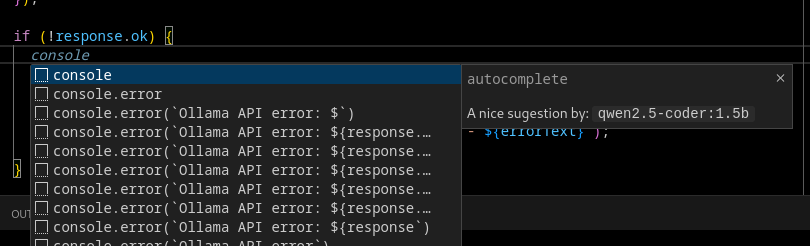
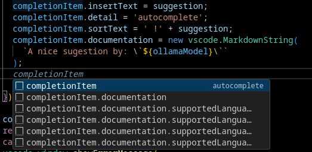
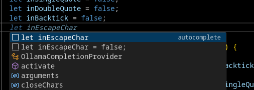
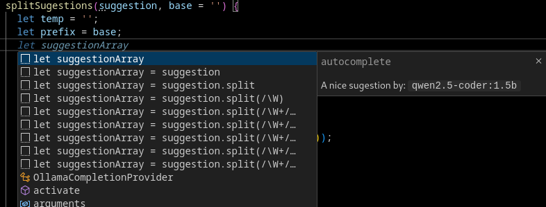

# Autocomplete VsCode Ollama

This is a Visual Studio Code extension that provides code autocomplete suggestions to the standard VS Code dropdown suggestion list using a local Ollama server. Instead of relying on external cloud services, this extension allows you to leverage the power of a large language model (LLM) running on your own machine.

## Features

- **Local LLM Autocomplete**: Integrates with your local Ollama server to add code suggestions to the standard VS Code dropdown suggestion list. The suggestions are split into individual completion items for easier selection.
- **Customizable**: Easily configure the Ollama host URL and the specific model you want to use directly in your VS Code settings.
- **Multi-Language Support**: Provides completion items for a wide range of languages, including:
  - TypeScript
  - JavaScript
  - Python
  - Java
  - HTML
  - CSS
  - JSON

## Requirements

- **Visual Studio Code**: The extension requires VS Code to be installed.
- **Ollama**: You must have the Ollama application installed and running on your machine.
- **An Ollama Model**: You need to have a code-aware model that supports FIM downloaded and available in Ollama (e.g., `qwen2.5-coder:1.5b` or `codellama`). You can download one by running a command like `ollama pull qwen2.5-coder:1.5b` in your terminal.

## Extension Settings

This extension contributes the following settings, which you can modify in your VS Code settings (`settings.json`):

| Setting                     | Type     | Default Value            | Description                                           |
| --------------------------- | -------- | ------------------------ | ----------------------------------------------------- |
| `autocompleter.ollamaHost`  | `string` | `http://localhost:11434` | The URL of your local Ollama server.                  |
| `autocompleter.ollamaModel` | `string` | `qwen2.5-coder:1.5b`     | The Ollama model to use for autocomplete suggestions. |

## Usage

1.  **Install the Extension**: Install this extension from the vsix file.
2.  **Start Ollama**: Ensure the Ollama server is running.
3.  **Download a Model**: Download a code model that supports FIM (e.g., `ollama pull qwen2.5-coder:1.5b`).
4.  **Configure Settings**: If your Ollama host or model name is different from the defaults, update the settings in VS Code.
5.  **Start Coding**: The extension will automatically activate for the supported languages and provide suggestions as you type.

## For Developers

- **Linting**: Use `npm run lint` to run the linter.
- **Testing**: Use `npm test` to run the extension tests.

## Known Issues

Calling out known issues can help limit users from opening duplicate issues against your extension. As of now, there are no specific known issues.

## Screenshots

[]

[]

[]

[]

**Enjoy!**
